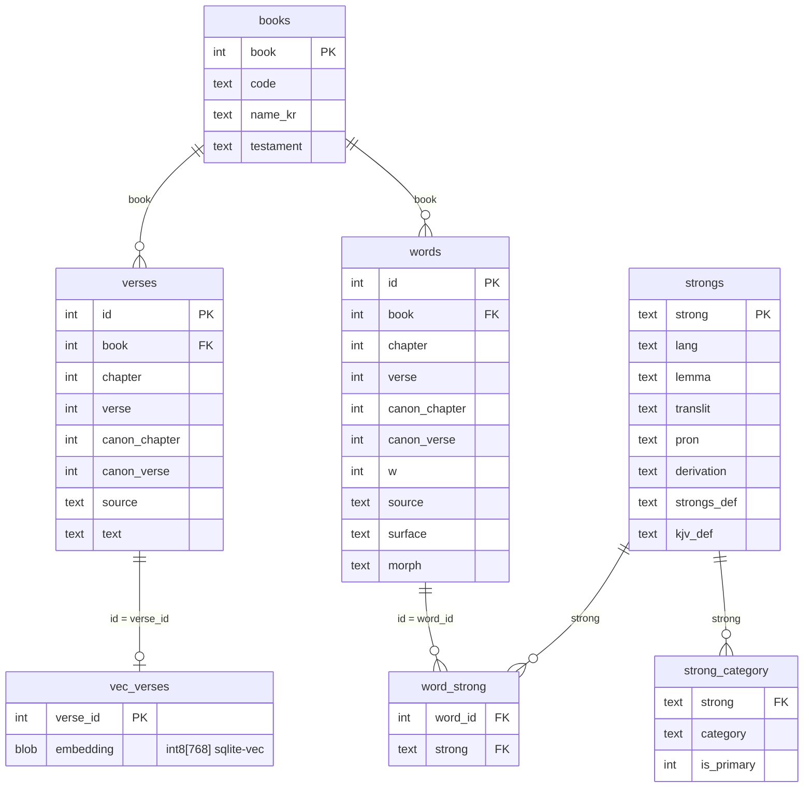

# bible-db

*[English README](README.md)*

**다국어 성경 데이터셋** — 4개 언어 병렬 + Strong 번호 + **원어 단어마다 의미 도메인 태그**. 전부 퍼블릭 도메인 / 오픈 라이선스 소스에서 수집했고, 깔끔한 JSONL과 단일 SQLite 파일로 제공한다.

차별점: 히브리어·그리스어 단어마다 **의미 카테고리**(`animal>livestock`, `plant>fruit`, `nature>mineral_gem` …)가 붙어 있어, 다른 성경 데이터셋엔 없는 질문에 바로 답한다.

> *"성경에서 **과일**은 어떻게 언급되나? 어떤 **가축**이 등장하나? **보석**·**악기**·**친족** 용어는?"*

## 무엇이 들어있나

| 데이터 | 규모 | 출처 / 라이선스 |
|--------|------|------------------|
| 개역한글 (1961) | 31,101절 | 대한성서공회 — **Public Domain** |
| KJV (1769) | 31,102절 | scrollmapper (CrossWire/eBible) — **PD** |
| 히브리어 (Westminster Leningrad Codex) | 23,213절 / 30.5만 단어 | openscriptures/morphhb — 본문 PD / 태깅 **CC BY 4.0** |
| 그리스어 (Byzantine, Robinson-Pierpont 2018) | 7,953절 / 14만 단어 | byztxt — **PD** |
| Strong's 히브리어·그리스어 사전 | 8,674 + 5,523 엔트리 | openscriptures/strongs — **CC BY-SA** |
| **의미 카테고리** | 14,197 단어 → 18 도메인 / 20,450 태그 | 본 프로젝트 — **CC BY 4.0** |
| **의미 벡터** | 62,203절 임베딩 (한국어 + 영어) | Gemini Embedding 2 · 768차원 int8 — **CC BY 4.0** |

원어 단어마다 Strong 번호 + 형태소가 붙어 있다. 소스별 라이선스·출처 표기는 [`NOTICE`](NOTICE) 참조.

## 데이터 맛보기

핵심은 *병렬*이다. 모든 절이 언어 간 정렬되도록 키가 붙어 있고, 원어 단어마다 Strong 번호·형태소·의미 태그가 달려 있다.

**한 절, 네 소스** — 창세기 1:1 (원본 좌표):

| `source` | `text` |
|----------|--------|
| `krv` (한국어) | 태초에 하나님이 천지를 창조하시니라 |
| `kjv` (영어) | In the beginning God created the heaven and the earth. |
| `wlc` (히브리어) | בְּרֵאשִׁ֖ית בָּרָ֣א אֱלֹהִ֑ים אֵ֥ת הַשָּׁמַ֖יִם וְאֵ֥ת הָאָֽרֶץ ׃ |

*(신약 절은 히브리어 대신 그리스어 `byz` 본문과 짝지어진다.)*

**모든 단어에 태그** — 같은 절을 `words → word_strong → strongs → strong_category`로 분해:

| `w` | `surface` (히브리어) | `strong` | `translit` | 의미 (`strongs_def` 발췌) | 주의미 `category` |
|----:|---------------------|----------|------------|---------------------------|-------------------|
| 1 | בְּרֵאשִׁ֖ית  | H7225 | rêʼshîyth | "the first… (specifically, a firstfruit)" | `time>period` |
| 2 | בָּרָ֣א     | H1254 | bârâʼ     | "(absolutely) to create…"                 | `action>make_labor` |
| 3 | אֱלֹהִ֑ים   | H430  | ʼĕlôhîym  | "…specifically… the supreme God"          | `deity_spirit>divine_name` |
| 4 | אֵ֥ת      | H853  | ʼêth      | "…the object of a verb or preposition"    | `function_word>particle_adverb` |
| 5 | הַשָּׁמַ֖יִם   | H8064 | shâmayim  | "the sky (as aloft…)"                     | `nature>celestial` |
| 6 | וְאֵ֥ת     | H853  | ʼêth      | "…the object of a verb or preposition"    | `function_word>particle_adverb` |
| 7 | הָאָֽרֶץ    | H776  | ʼerets    | "the earth (at large…)"                   | `nature>earth_stone` |

이 `category` 컬럼이 다른 성경 데이터셋엔 없는 레이어다 — 문자열 매칭이 아니라 *의미*(과일·가축·보석·친족…)로 본문을 질의하게 해준다.

## 빠른 시작

[Releases](../../releases)에서 `bible.sqlite.gz`를 받아 압축 해제 후 질의:

```sql
-- "성경에서 과일이 언급된 구절"  (엄격 = 주의미만, 노이즈 적음)
SELECT DISTINCT b.code, v.chapter, v.verse, v.text
FROM strong_category sc
JOIN word_strong ws ON ws.strong = sc.strong
JOIN words w        ON w.id = ws.word_id
JOIN verses v       ON v.book=w.book AND v.chapter=w.chapter AND v.verse=w.verse AND v.source='krv'
JOIN books b        ON b.book = v.book
WHERE sc.category = 'plant>fruit' AND sc.is_primary = 1;
```

또는 이 repo의 JSONL에서 직접 빌드:

```bash
uv run scripts/build_db.py     # data/*/*.jsonl  ->  data/bible.sqlite
```

## 스키마



| 테이블 | 행 수 | 컬럼 | 내용 |
|--------|------:|------|------|
| `books` | 66 | `book` PK · `code` · `name_kr` · `testament` | 66권 색인 (구약/신약) |
| `verses` | 93,369 | `id` PK · `book` · `chapter` · `verse` · `canon_chapter` · `canon_verse` · `source` · `text` | **소스별** 절 1행 |
| `words` | 445,656 | `id` PK · `book` · `chapter` · `verse` · `canon_*` · `w` · `source` · `surface` · `morph` | 원어 단어 1개 |
| `word_strong` | 439,705 | `word_id` · `strong` | 단어 ↔ Strong (`wlc`→`H####`, `byz`→`G####`) |
| `strongs` | 14,197 | `strong` PK · `lang` · `lemma` · `translit` · `pron` · `derivation` · `strongs_def` · `kjv_def` | Strong 사전 엔트리 |
| `strong_category` | 20,450 | `strong` · `category` · `is_primary` | 의미 도메인 태그 (`major>minor`) |
| `vec_verses` | 62,203 | `verse_id` · `embedding int8[768]` | 절 임베딩 (한+영) |

`vec_verses`는 [`sqlite-vec`](https://github.com/asg017/sqlite-vec) 가상 테이블 — 조회하려면
확장을 로드해야 하고, 무시하면 나머지 DB는 그대로 동작한다.

`source` 값: `krv`(개역한글) · `kjv` · `wlc`(히브리어) · `byz`(그리스어).

`canon_chapter` / `canon_verse`는 모든 절에 **canonical(KJV) 좌표**를 부여해 4개 소스가 한 키로 정렬되게 한다 — 히브리어 시편 표제, 장 분할, 절 경계 이동이 정규화되고 원본 `chapter` / `verse`는 그대로 보존된다. 시편 표제는 `canon_verse = 0`.

## 의미 카테고리 — 차별 레이어

모든 Strong 엔트리를 18개 도메인 체계(`animal`, `plant`, `human_body`, `nature`, `artifact`, `ritual`, `abstract_quality` …)로 분류했다. `major>minor` 키, multi-label, 그리고 `is_primary` 주의미 1개. 전체 목록은 [`data/categories/taxonomy.md`](data/categories/taxonomy.md).

**다의어는 `is_primary`로 처리한다.** 예: G1081 *γέννημα* = "자손 / 산물"은 `person_role>kinship`(primary)과 `plant>fruit` 둘 다 태깅. 엄격 검색(`is_primary=1`)은 "독사의 자식"을 제외하고, 넓은 검색은 포함한다. 질의마다 정밀도 vs 재현율을 조절할 수 있다.

```sql
-- 성경에 등장하는 가축 종류
SELECT DISTINCT s.strong, s.lemma, s.translit, s.strongs_def
FROM strong_category sc JOIN strongs s ON sc.strong = s.strong
WHERE sc.category = 'animal>livestock';
```

## 의미 검색 — 자연어 벡터 색인

한국어(`krv`)·영어(`kjv`) 모든 절을 **Gemini Embedding 2**(768차원, int8 양자화)로
임베딩해 [`sqlite-vec`](https://github.com/asg017/sqlite-vec) `vec0` 테이블에 넣었다. 그래서
*의미*로 검색할 수 있고, 모델이 cross-lingual이라 **한국어 쿼리로 영어 구절**도, 그 반대도 찾는다.

```bash
# GEMINI_API_KEY 필요(쿼리를 런타임에 임베딩) — pip install sqlite-vec
uv run scripts/search.py "불안할 때 위로가 되는 말씀" --lang ko --k 10
uv run scripts/search.py "the good shepherd"
```

내부는 평범한 sqlite-vec KNN을 `verses`에 다시 조인하는 것:

```sql
-- 먼저 확장 로드: Python은 sqlite_vec.load(conn), CLI는 .load vec0
SELECT v.source, b.code, v.chapter, v.verse, v.text, k.distance
FROM (SELECT verse_id, distance FROM vec_verses
      WHERE embedding MATCH vec_int8(:qvec) AND k = 10 ORDER BY distance) k
JOIN verses v ON v.id = k.verse_id
JOIN books  b ON b.book = v.book;
```

벡터는 **derived 레이어**다. Gemini는 API 기반·비결정적이라, int8 벡터를 `data/embeddings/`에
글자 그대로 커밋해두고 `build_db.py`가 통합한다 — **DB 재빌드에 API 키가 필요 없다**. 모델/차원을
바꿀 때만 재생성: `GEMINI_API_KEY=… uv run scripts/embed_verses.py`.

## 병렬 절 & 단어 조회

```sql
-- 한 절을 여러 번역 + 원어로 (원본 좌표)
SELECT source, text FROM verses WHERE book=1 AND chapter=1 AND verse=1;

-- canonical(KJV) 좌표로 전 언어 정렬 — 히브리어 표제/분할 offset 처리.
-- 시 3:1: kjv/krv는 3:1, 히브리는 자기 3:2에 정렬 (히브리 3:1은 표제 -> canon_verse 0).
SELECT source, chapter, verse, text FROM verses WHERE book=19 AND canon_chapter=3 AND canon_verse=1;

-- 단어 -> Strong -> 정의: words -> word_strong -> strongs 조인
```

## 소스에서 빌드

```
scripts/
  books.py            66권 매핑 + OSIS/USFM 유틸
  crawl_holybible.py  개역한글 (holybible.or.kr)
  crawl_bskorea.py    개역한글 (bible.bskorea.or.kr)
  crosscheck.py       두 개역한글 소스 diff
  parse_kjv.py        scrollmapper KJV -> JSONL
  parse_wlc.py        morphhb OSIS XML -> 절 + 단어별 Strong/형태소
  parse_byz.py        byztxt CSV -> JSONL
  parse_tagnt.py      STEPBible TAGNT -> 단어별 판본비교 (데이터 미포함)
  parse_strongs.py    Strong's JS 사전 -> JSON
  split_strongs.py    Strong 엔트리 -> 분류 배치
  merge_categories.py 분류 배치 머지 + taxonomy 키 검증
  embed_verses.py     한+영 절 -> Gemini Embedding 2 -> int8 벡터 (data/embeddings/)
  search.py           자연어 의미 검색 데모 (sqlite-vec KNN)
  build_db.py         전부 SQLite로 통합 (+ 벡터 있으면 함께 통합)
```

원본 소스 clone(`data/sources/`)은 **재배포하지 않는다** — parse 스크립트가 받아온다. STEPBible TAGNT 데이터는 재배포 권고에 따라 미포함(`parse_tagnt.py`로 직접 생성, `NOTICE` 참조).

## 참고

- **한국어 본문**(`krv`)은 holybible.or.kr에서 크롤한 개역한글(완전). 절 번호는 KJV를 따르되 4곳에서 절 경계가 달라 canonical 좌표로 보정한다(아래 참조). 빌드 시 2차 크롤(bible.bskorea.or.kr)과 diff해 크로스체크하지만(`crosscheck.py`) **DB엔 포함하지 않는다** — 그 크롤은 일부 절 번호 밀림 + 시편 92편 누락(사이트측 렌더 누락)이 있다.
- versification: 원어(`wlc`) 좌표는 `chapter` / `verse`에 보존하고, canonical KJV 좌표를 `canon_chapter` / `canon_verse`에 추가해 모든 소스가 한 키로 정렬되게 했다. 매핑은 [Copenhagen Alliance versification spec](https://github.com/Copenhagen-Alliance/versification-specification)(`eng.json`)에서 가져왔고, 히브리어 시편 표제·요엘/말라기 장 분할·절 경계 이동을 정규화한다. 개역한글(`krv`)도 대체로 KJV를 따르지만 4곳에서 절 경계가 달라(예: 고후 13, 아 6:13) 같은 좌표로 보정한다. 언어 간 조인은 원본 절 키가 아니라 **canonical 좌표로** 한다.
- **본문은 AI가 생성·교정하지 않는다** — 검증된 소스에서 글자 그대로 수집. 의미 카테고리만 기계 생성(Strong 사전에 그라운딩).

## 라이선스

코드(`scripts/`): **MIT**. 데이터: 소스별(Public Domain / CC BY 4.0 / CC BY-SA) — [`LICENSE`](LICENSE), [`NOTICE`](NOTICE) 참조.
