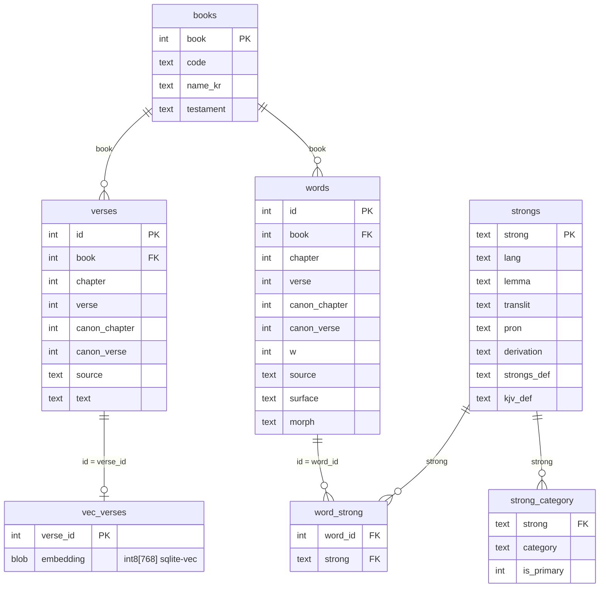

# bible-db

[](https://github.com/crizin/bible-db/actions/workflows/release.yml)
[](https://github.com/crizin/bible-db/releases/latest)
[](https://github.com/crizin/bible-db/releases)
[](LICENSE)
[](NOTICE)

*[한국어 README](README.ko.md)*

A **multilingual Bible dataset**: four languages in parallel + Strong's numbers + **semantic-domain tags on every original-language word** — all from public-domain / openly-licensed sources, shipped as clean JSONL and a single SQLite file.

What makes it different: each Hebrew/Greek word is tagged with a **semantic category** (`animal>livestock`, `plant>fruit`, `nature>mineral_gem`, …), so you can ask questions no other Bible dataset answers out of the box:

> *"Where does the Bible mention **fruit**? Which **livestock** appears? What **gems**, **instruments**, **kinship** terms?"*

## What's inside

| Data | Size | Source / License |
|------|------|------------------|
| Korean 개역한글 (1961) | 31,101 verses | Korean Bible Society — **Public Domain** |
| KJV (1769) | 31,102 verses | scrollmapper (CrossWire/eBible) — **PD** |
| Hebrew (Westminster Leningrad Codex) | 23,213 verses / 305K words | openscriptures/morphhb — PD text / **CC BY 4.0** tagging |
| Greek (Byzantine, Robinson-Pierpont 2018) | 7,953 verses / 140K words | byztxt — **PD** |
| Strong's Hebrew & Greek lexicon | 8,674 + 5,523 entries | openscriptures/strongs — **CC BY-SA** |
| **Semantic categories** | 14,197 words → 18 domains / 20,450 tags | this project — **CC BY 4.0** |
| **Semantic vectors** | 62,203 verse embeddings (Korean + English) | Gemini Embedding 2 · 768-d int8 — **CC BY 4.0** |

Every original-language word carries its Strong number + morphology. Full per-source licensing & attribution in [`NOTICE`](NOTICE).

## A taste of the data

The whole point is *parallel*: every verse is keyed so the same passage lines up across languages, and every original-language word carries a Strong's number, morphology, and a semantic tag.

**One verse, four sources** — Genesis 1:1 (raw coordinate):

| `source` | `text` |
|----------|--------|
| `krv` (Korean)  | 태초에 하나님이 천지를 창조하시니라 |
| `kjv` (English) | In the beginning God created the heaven and the earth. |
| `wlc` (Hebrew)  | בְּרֵאשִׁ֖ית בָּרָ֣א אֱלֹהִ֑ים אֵ֥ת הַשָּׁמַ֖יִם וְאֵ֥ת הָאָֽרֶץ ׃ |

*(New Testament verses pair Korean/English with the Greek `byz` text instead of Hebrew.)*

**Every word, tagged** — the same verse decomposed via `words → word_strong → strongs → strong_category`:

| `w` | `surface` (Hebrew) | `strong` | `translit` | sense (`strongs_def`, excerpt) | primary `category` |
|----:|--------------------|----------|------------|--------------------------------|--------------------|
| 1 | בְּרֵאשִׁ֖ית  | H7225 | rêʼshîyth | "the first… (specifically, a firstfruit)" | `time>period` |
| 2 | בָּרָ֣א     | H1254 | bârâʼ     | "(absolutely) to create…"                 | `action>make_labor` |
| 3 | אֱלֹהִ֑ים   | H430  | ʼĕlôhîym  | "…specifically… the supreme God"          | `deity_spirit>divine_name` |
| 4 | אֵ֥ת      | H853  | ʼêth      | "…the object of a verb or preposition"    | `function_word>particle_adverb` |
| 5 | הַשָּׁמַ֖יִם   | H8064 | shâmayim  | "the sky (as aloft…)"                     | `nature>celestial` |
| 6 | וְאֵ֥ת     | H853  | ʼêth      | "…the object of a verb or preposition"    | `function_word>particle_adverb` |
| 7 | הָאָֽרֶץ    | H776  | ʼerets    | "the earth (at large…)"                   | `nature>earth_stone` |

That `category` column is the layer no other Bible dataset ships — it's what lets you query the text by *meaning* (fruit, livestock, gems, kinship…) instead of by string match.

## Quick start

Grab `bible.sqlite.gz` from the [Releases](../../releases) page, decompress, and query:

```sql
-- "Where does the Bible mention fruit?"  (strict = primary sense only, low noise)
SELECT DISTINCT b.code, v.chapter, v.verse, v.text
FROM strong_category sc
JOIN word_strong ws ON ws.strong = sc.strong
JOIN words w        ON w.id = ws.word_id
JOIN verses v       ON v.book=w.book AND v.chapter=w.chapter AND v.verse=w.verse AND v.source='kjv'
JOIN books b        ON b.book = v.book
WHERE sc.category = 'plant>fruit' AND sc.is_primary = 1;
```

Or build the DB yourself from the JSONL in this repo:

```bash
uv run scripts/build_db.py     # data/*/*.jsonl  ->  data/bible.sqlite
```

## Schema



| Table | Rows | Columns | Holds |
|-------|-----:|---------|-------|
| `books` | 66 | `book` PK · `code` · `name_kr` · `testament` | 66-book index (OT/NT) |
| `verses` | 93,369 | `id` PK · `book` · `chapter` · `verse` · `canon_chapter` · `canon_verse` · `source` · `text` | one row per verse **per source** |
| `words` | 445,656 | `id` PK · `book` · `chapter` · `verse` · `canon_*` · `w` · `source` · `surface` · `morph` | one original-language word |
| `word_strong` | 439,705 | `word_id` · `strong` | word ↔ Strong (`wlc`→`H####`, `byz`→`G####`) |
| `strongs` | 14,197 | `strong` PK · `lang` · `lemma` · `translit` · `pron` · `derivation` · `strongs_def` · `kjv_def` | Strong's lexicon entry |
| `strong_category` | 20,450 | `strong` · `category` · `is_primary` | semantic-domain tag (`major>minor`) |
| `vec_verses` | 62,203 | `verse_id` · `embedding int8[768]` | verse embedding (ko+en) |

`vec_verses` is a [`sqlite-vec`](https://github.com/asg017/sqlite-vec) virtual table — load the
extension to query it; ignore it and the rest of the DB works unchanged.

`source` values: `krv` (Korean 개역한글), `kjv`, `wlc` (Hebrew), `byz` (Greek).

`canon_chapter` / `canon_verse` give every verse a **canonical (KJV) coordinate** so all four sources align on one key — Hebrew psalm titles, chapter splits, and verse-boundary shifts are reconciled while the original `chapter` / `verse` stay untouched. Psalm titles map to `canon_verse = 0`.

## Semantic categories — the distinctive layer

Every Strong entry is classified into an 18-domain taxonomy (`animal`, `plant`, `human_body`, `nature`, `artifact`, `ritual`, `abstract_quality`, …) with `major>minor` keys. Multi-label, with one `is_primary` sense. Full list in [`data/categories/taxonomy.md`](data/categories/taxonomy.md).

**Polysemy is handled via `is_primary`.** E.g. G1081 *γέννημα* = "offspring / produce" is tagged both `person_role>kinship` (primary) and `plant>fruit`. A strict fruit search (`is_primary=1`) excludes "offspring of vipers"; a broad search includes it. So you tune precision vs. recall per query.

```sql
-- distinct livestock animals attested in the Bible
SELECT DISTINCT s.strong, s.lemma, s.translit, s.strongs_def
FROM strong_category sc JOIN strongs s ON sc.strong = s.strong
WHERE sc.category = 'animal>livestock';
```

## Semantic search — natural-language vector index

Every Korean (`krv`) and English (`kjv`) verse is embedded with **Gemini Embedding 2**
(768-dim, int8-quantized) into a [`sqlite-vec`](https://github.com/asg017/sqlite-vec) `vec0` table,
so you can search by *meaning* — and across languages, since the model is cross-lingual (a Korean
query surfaces English verses and vice versa).

```bash
# needs GEMINI_API_KEY (the query is embedded at runtime) — pip install sqlite-vec
uv run scripts/search.py "comfort when I am anxious" --k 10
uv run scripts/search.py "사랑은 오래 참고" --lang ko
```

Under the hood it is a plain sqlite-vec KNN joined back to `verses`:

```sql
-- load the extension first: sqlite_vec.load(conn) in Python, or .load vec0 in the CLI
SELECT v.source, b.code, v.chapter, v.verse, v.text, k.distance
FROM (SELECT verse_id, distance FROM vec_verses
      WHERE embedding MATCH vec_int8(:qvec) AND k = 10 ORDER BY distance) k
JOIN verses v ON v.id = k.verse_id
JOIN books  b ON b.book = v.book;
```

The vectors are a **derived** layer: Gemini is API-based and non-deterministic, so the int8 vectors
are committed verbatim under `data/embeddings/` and `build_db.py` folds them in — **no API key is
needed to rebuild the DB**. Regenerate them only when changing model/dimension:
`GEMINI_API_KEY=… uv run scripts/embed_verses.py`.

## Parallel verses & word lookup

```sql
-- one verse across translations + original (raw coordinate)
SELECT source, text FROM verses WHERE book=1 AND chapter=1 AND verse=1;

-- align all languages on the canonical (KJV) coordinate — handles Hebrew title/split offsets.
-- Ps 3:1: kjv/krv land on 3:1, Hebrew on its own 3:2 (Hebrew 3:1 is the title -> canon_verse 0).
SELECT source, chapter, verse, text FROM verses WHERE book=19 AND canon_chapter=3 AND canon_verse=1;

-- word -> Strong -> definition: join words -> word_strong -> strongs
```

## Build from source

```
scripts/
  books.py            66-book mapping + OSIS/USFM utils
  crawl_holybible.py  Korean (holybible.or.kr)
  crawl_bskorea.py    Korean (bible.bskorea.or.kr)
  crosscheck.py       diff the two Korean sources
  parse_kjv.py        scrollmapper KJV -> JSONL
  parse_wlc.py        morphhb OSIS XML -> verses + per-word Strong/morph
  parse_byz.py        byztxt CSV -> JSONL
  parse_tagnt.py      STEPBible TAGNT -> per-word edition comparison (data not bundled)
  parse_strongs.py    Strong's JS dictionaries -> JSON
  split_strongs.py    Strong entries -> classification batches
  merge_categories.py merge category batches + validate taxonomy keys
  embed_verses.py     ko+en verses -> Gemini Embedding 2 -> int8 vectors (data/embeddings/)
  search.py           natural-language semantic search demo (sqlite-vec KNN)
  build_db.py         assemble everything into SQLite (+ fold in vectors if present)
```

Original-source clones (`data/sources/`) are **not** redistributed — the parse scripts fetch them. STEPBible TAGNT data is omitted per its redistribution guidance (run `parse_tagnt.py` yourself; see `NOTICE`).

## Notes

- **The Korean text** (`krv`) is the 개역한글 crawled from holybible.or.kr — complete; its numbering follows KJV except at 4 verse boundaries, reconciled into the canonical coordinate (see below). A second crawl (bible.bskorea.or.kr) is diffed against it at build time (`crosscheck.py`) but **not shipped in the DB**; that crawl has minor versification shifts and is missing Psalm 92 (site-side render gap).
- Versification: the original (`wlc`) coordinate is preserved in `chapter` / `verse`, and a canonical KJV coordinate is added in `canon_chapter` / `canon_verse` so all sources align on one key. The mapping is from the [Copenhagen Alliance versification spec](https://github.com/Copenhagen-Alliance/versification-specification) (`eng.json`); Hebrew psalm titles, the Joel/Malachi chapter splits, and verse-boundary shifts are reconciled. Korean (`krv`) mostly follows KJV too but differs at 4 verse boundaries (e.g. 2Co 13, Song 6:13), folded into the same coordinate. **Join across languages on the canonical coordinate**, not the raw verse key.
- **Texts are never AI-generated or "corrected"** — collected verbatim from verified sources. Only the semantic categories are machine-generated, grounded in Strong's lemmas/definitions.

## License

Code (`scripts/`): **MIT**. Data: per-source (Public Domain / CC BY 4.0 / CC BY-SA) — see [`LICENSE`](LICENSE) and [`NOTICE`](NOTICE).
